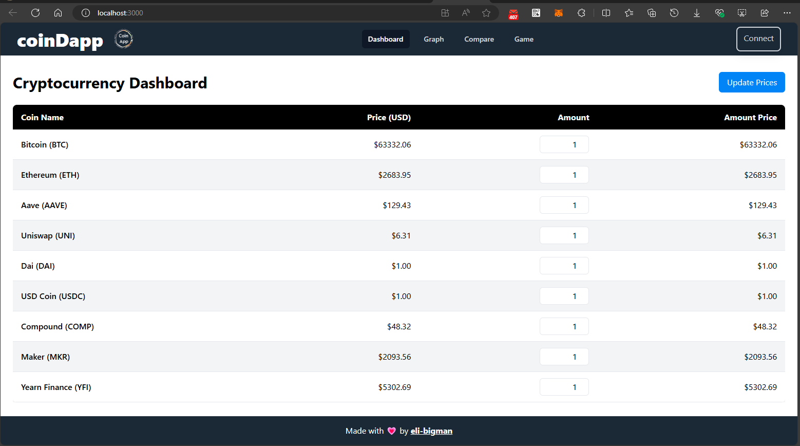
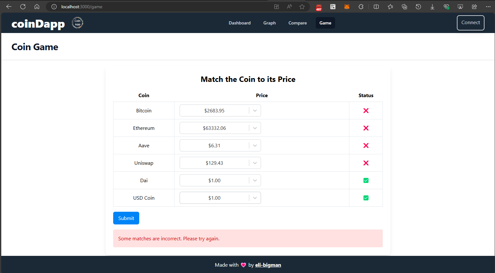
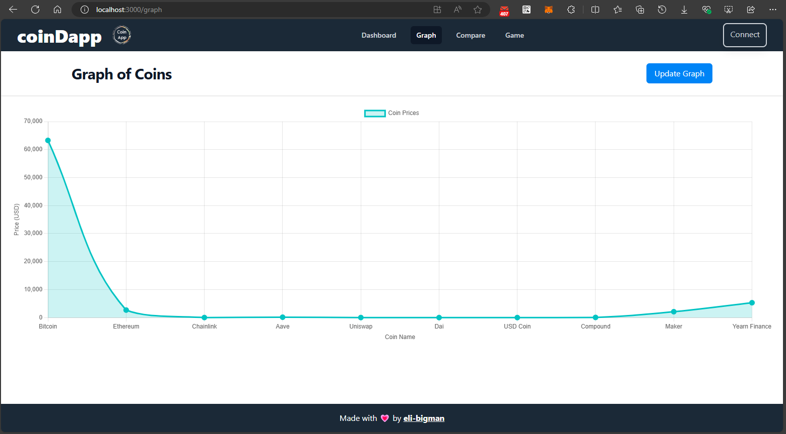
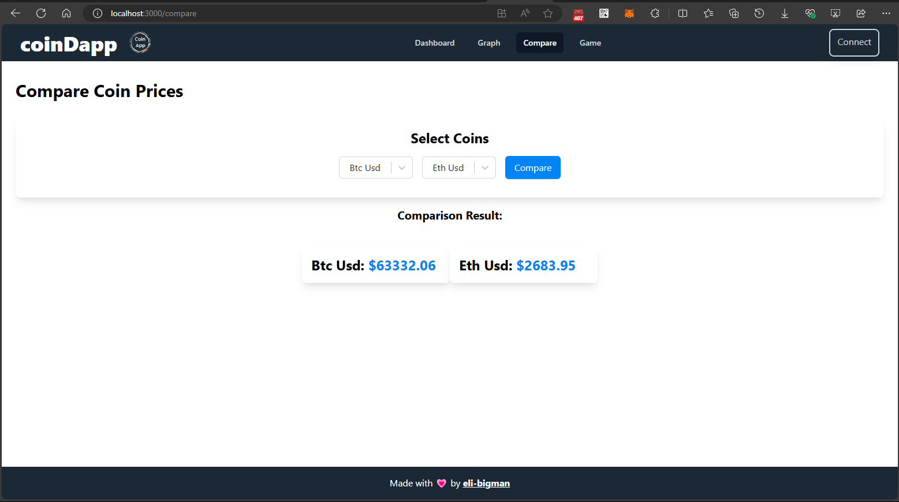

# CoinDapp 🚀

CoinDapp is a comprehensive cryptocurrency dashboard application built with love using Web3.js. It consists of four main parts:

## Dashboard 📊

The dashboard provides real-time prices of various cryptocurrencies and allows users to update prices and manage their portfolio.

## Game 🎮

The game section is an interactive feature where users can match cryptocurrencies to their correct prices.

## Graph 📈

The graph section visualizes the price trends of different cryptocurrencies over time.

## Compare 🔍

The compare section allows users to compare the prices of two selected cryptocurrencies.

## Built With ❤️

- [Web3.js](https://github.com/ChainSafe/web3.js)

## Getting Started

This project was bootstrapped with [Create React App](https://github.com/facebook/create-react-app).

### Available Scripts

In the project directory, you can run:

#### `npm start`

Runs the app in the development mode.\
Open [http://localhost:3000](http://localhost:3000) to view it in your browser.

The page will reload when you make changes.\
You may also see any lint errors in the console.

#### `npm test`

Launches the test runner in the interactive watch mode.\
See the section about [running tests](https://facebook.github.io/create-react-app/docs/running-tests) for more information.

